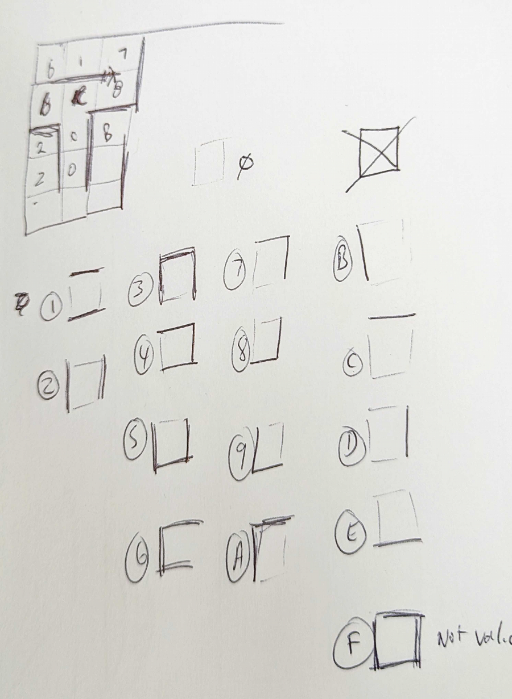

 

# HTML and Javascript Maxe
An attempt at creating a maze in javascript and html only. 

## Rules
* top, bottom, left, and right rows must have outer borders
* corners must have both closed sides bordered
* single cells that do not connect should not be allowed (*not yet implemented*)
* a path should exist between start and finish (*not yet implemented*)

## Cell design
the cells have 16 cell types

## Todo
* change cells object array to an object that we can reference
* implement rules not yet implemented (*above*)
* create a clearly defined entrance and exit to the maze
